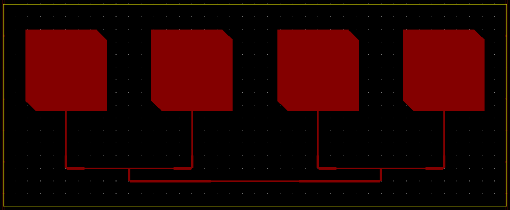
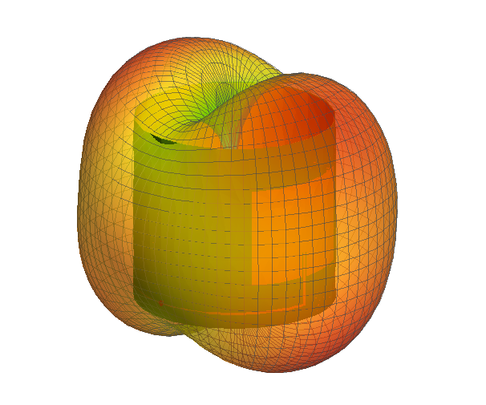

# Aperture

Aperture is a python program to automate the design of conformal patch antenna arrays and feed networks for rockets.

Specifications for a particular frequency, dielectric material, rocket tube size, polarisation etc. are stored in a JSON file which is then passed to the program as a command line argument.

**Note:** this is a work in progress, but for now you can see what happens when you play around with different values in the specification file.

Aperture is not a replacement for EM simulations as it does not perform any numerical EM analysis itself. Microstrip lines, power splitters etc. don't care too much about being wrapped around a cylinder, but antennas might. For this reason, this program should be used alongside an EM software package to ensure antennas operate as required. Calculated values needed to draw the model are printed to the console.

  

The workflow might look something like this:

1. Run Aperture on specification file to calculate initial dimensions

2. Use an EM simulation tool such as Altair FEKO to optimise the antenna dimensions in the conformed shape

3. Re-run Aperture, overriding the antenna dimensions with the optimised values, to generate a KiCAD-compatable file of the antennas and feed network suitable for manufacture.

## Usage Guide

1. Clone the repo

2. Navigate to it in the command line

3. Run the command `python aperture.py <path>` where `<path>` is the relative path from the current directory to the specification file. To run the example included, this would be `python aperture.py examples/aquila_gps.json`

4. Some useful numbers will be printed in the console, and a .kicad_pcb file will be generated in the same location as the specification file and with the same name.

5. Complete the KiCAD file by adding ground planes, connector footprints, or adjusting the board cuts as necessary.

## Files

*  **aperture.py** - file that is called from the command line, reads specification file and executes the rest of the procedure

*  **em_calcs.py** - contains functions for various calculations of geometric/electromagnetic parameters

*  **components.py** - stores components that can be assembled into an array and plotted as a PCB

*  **plot.py** - contains the functions to construct arrays from components and output their into a file

*  **pcb_template.kicad_pcb** - header template for generating kicad files, do not move or rename!

*  **/examples** - contains example specification files and their outputs