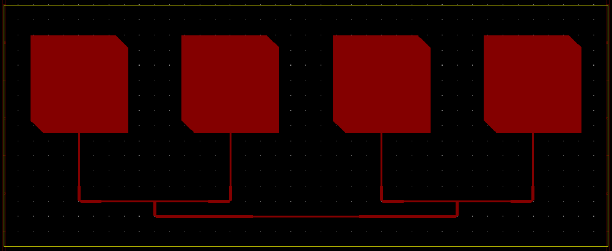
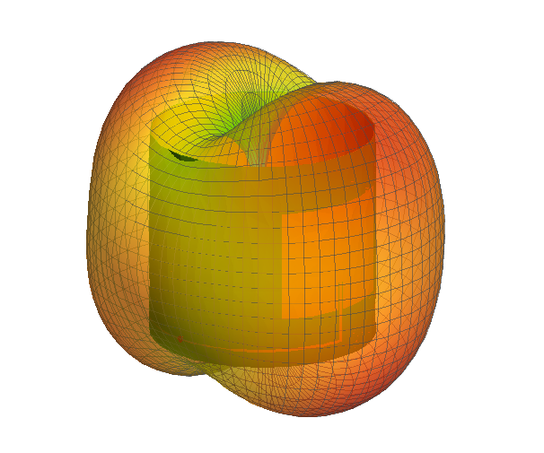

# Aperture

Aperture is a python program to automate the design of conformal patch antenna arrays and feed networks for rockets, on double-sided copper-clad dielectric with 50 Ohm pin feed. It performs necessary calculations and produces KiCAD and DXF files of the generated design with a single command.

Specifications for a particular frequency, dielectric material, rocket tube size, polarisation, number of patches etc. are set in a JSON file.

Aperture is not a replacement for electromagnetic simulations as it uses analytic equations for planar circuits. Microstrip lines, power splitters etc. likely won't care too much about being wrapped around a cylinder, but antennas might. For this reason, it might be worth using an EM software package to ensure the generated antennas operate as required before manufacturing.

## Usage Guide

1. Clone the repo

2. Navigate to it in the command line

3. Run the command `python aperture.py <path>` where `<path>` is the relative path from the current directory to the specification JSON file. To run one of the included examples, this would be `python aperture.py examples/aquila_gps.json`

4. Some useful numbers will be printed in the console, and `.kicad_pcb` and `.dxf` files will be generated in the same location as the specification file and with the same name.

5. If desired, import the design into your EM analysis tool of choice and optimise dimensions in the conformed shape. Then re-run Aperture overriding the patch dimensions.

6. Complete the KiCAD file by adding the ground plane, connector footprint, or adjusting the board cuts as necessary.

## Specification Options
The requirements of the antenna array are specified in a JSON file. The parameters available are detailed in the following table.

| Name | Required? | Accepted Values | Purpose |
| --- | --- | --- | --- |
| frequency | yes | any |The centre frequency of the antenna in Hz. |
| dielectric_thickness | yes | any | The thickness of the dielectric substrate in mm. |
| dielectric_constant | yes | any | The relative permittivity of the dielectric material. |
| copper_thickness | yes | any | Thickness of the copper cladding in mm. |
| body_radius | yes | any |The outer radius of the rocket body in mm (the width of the array will be equal to this circumference) |
| polarisation | yes | axial, rhcp, lhcp | The required polarisation of the antenna. Axial meaning linear polarisation with the E-field parallel to the axis of the rocket, and rhcp and lhcp meaning right-hand and left-hand circular polarisation respectively. |
| patch_count | yes | 1, 2, 4 | The number of patches in the array. A rule of thumb is that you want as many patches as will fit around the circumference to get the best coverage.
| patch_length | no | any | An override for the patch antenna length (in mm) in case simulation or experiments suggest a different length from that calculated by Aperture is required to achieve the desired resonant frequency in the conformed shape. |
| inset_distance | no | any | An override for the inset distance of axial patches (in mm) in case simulation or experiments suggest impedance is not quite matched in the conformed shape with the calculated inset.
| dissipation_factor | no | any | Dissipation factor of the dielectric material. Not currently used. |

## Examples
Two examples are included, `aquila_gps` and `aquila_telem`, Aquila being a Cambridge University Spaceflight rocket. The GPS antenna is an array of right-hand circularly polarised patches with centre frequency 1.575 GHz (first image), and the telemetry antenna is a pair of linearly polarised 868 MHz patches. The substrate used for these examples is 0.51 mm Rogers 5880.

## Validation
Antenna designs produced by this tool have been validated in Sonnet Lite and Altair FEKO simulation programs. The far-field produced by one of these tests is pictured below.

## Files

*  **aperture.py** - file that is called from the command line, reads specification file and executes the rest of the procedure

*  **em_calcs.py** - contains functions for various calculations of geometric/electromagnetic parameters

*  **components.py** - stores components that can be assembled into an array and plotted as a PCB

*  **plot.py** - contains the functions to construct the array from components and plot it into files

*  **pcb_template.kicad_pcb** - header template for generating kicad files, do not move or rename!

*  **/examples** - contains example specification files and their outputs